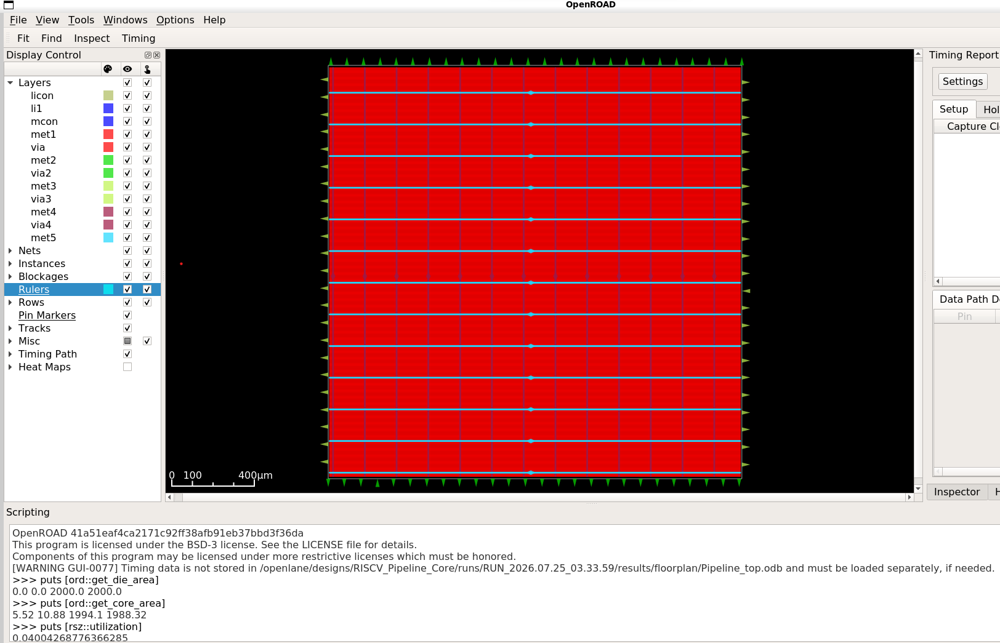

# Floorplan Stage

## Specifications

| Parameter | Value |
|---|---|
| Die Area | 2000 × 2000 μm |
| Core Area | 1988.58 × 1977.44 μm |
| Core Utilization (pre-placement) | 4.0% |
| Target Placement Density | 55% |
| Cell Instances (post-floorplan) | 65,098 |
| Nets | 7,513 |
| I/O Ports | 100 |
| PDK | SkyWater Sky130 (sky130_fd_sc_hd) |

## Description
Initial floorplanning defines the die and core boundaries, performs I/O pin placement,
inserts tap/decap cells for power planning, and generates the power distribution network (PDN).

## Visualization

## Logs
See `logs/` for detailed floorplan, I/O placement, tap/decap insertion, and PDN generation logs.

## Artifacts
See `def/Pipeline_top.def` for the floorplan-stage DEF file.
