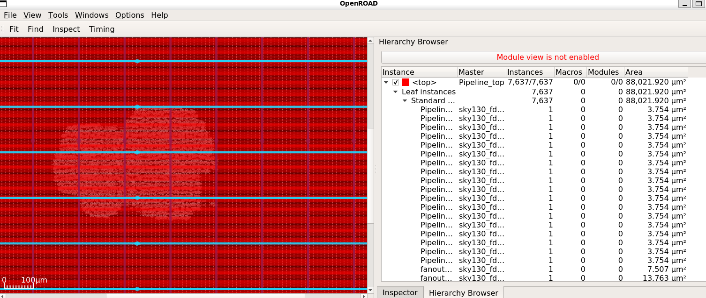

# Placement Stage

## Specifications

| Parameter | Value |
|---|---|
| Design Area (placement/routing) | 158,256 μm² |
| Standard Cell Area (actual silicon) | 88,021.92 μm² |
| Die Area | 2000 × 2000 μm |
| Core Utilization | 4% |
| Target Placement Density | 55% |
| Leaf Instances | 7,637 |
| Top Module Ports | clk, rst, pc_out, instr_out, result_out |

## Description
Global and detailed placement position standard cells within the core rows, guided by
timing and congestion-driven optimization. The design's actual utilization (4%) is low
relative to the die area since the die was sized generously (2000×2000 μm) for a compact
5-stage RISC-V pipeline core. The visualization below shows the concentrated cluster of
7,637 real standard cell instances (lighter, denser texture) surrounded by decap/tap
filler cells (uniform red) inserted during floorplanning.

## Visualization

### Placed Cells

## Logs
See `logs/` for global placement, resizer optimization, detailed placement, and STA logs.

## Artifacts
See `def/Pipeline_top.def` for the placement-stage DEF file.
