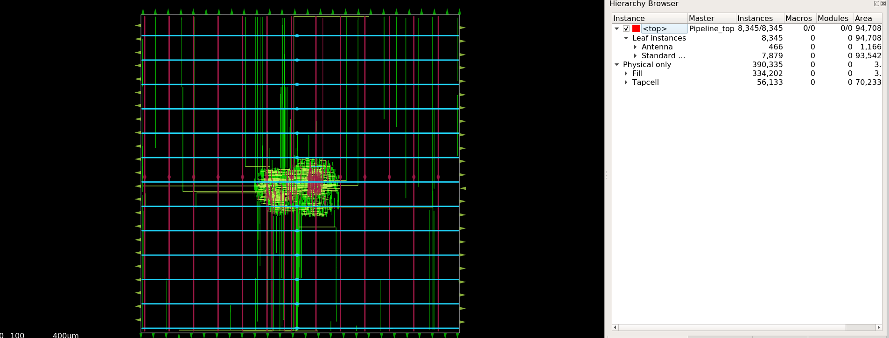

# Routing Stage

## Specifications

| Parameter | Value |
|---|---|
| Total Wirelength | 508,095 μm |
| Routed Nets | 7,881 |
| Standard Cell Instances | 7,879 |
| Standard Cell Area | 93,542 μm² |
| Antenna Diodes Inserted | 466 |
| Detailed Routing Violations | 0 (fully converged) |
| Antenna Violations | 0 (resolved via diode insertion) |
| Remaining Hold Violations | 103 endpoints |
| Max Fanout Violations | up to 137 (varies by optimization pass) |
| Max Slew Violations | 0 |
| Max Capacitance Violations | 0 |

## Description
Global and detailed routing connect all 7,881 nets across the sky130 metal stack (met1-met5),
achieving zero detailed routing violations after iterative refinement across multiple passes.
466 antenna diodes were inserted to fully resolve antenna violations. 103 hold-time violations
remain unrepaired at this stage — a common signoff-level timing issue addressed through further
optimization or accepted margin depending on design requirements.

## Visualization

## Logs
See `logs/` for resizer, global routing, detailed routing, and post-route STA logs.

## Artifacts
See `def/` for the routing-stage DEF file.
